# Name: Francis Aldrin Belmes
# Lab: The Power of Inheritance
***
## Exercise 1: Basic Inheritance: The extends Keyword
### Prediction:
<code>
Tuut, tuut! 
I am a Generic Vehicle Mustang 
</code>

### Observation:
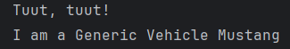
### Mini Challenge Code:
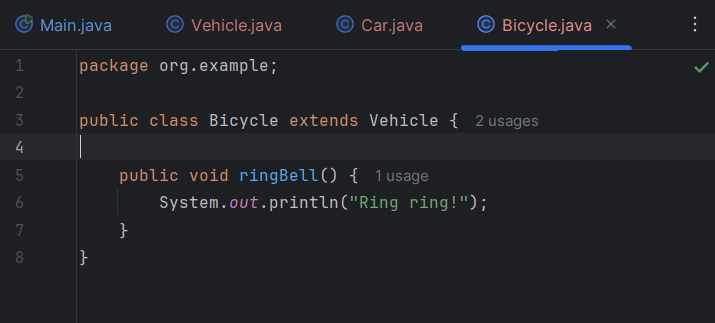
### Mini Challenge Output:
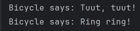

## Exercise 2: Abstract Classes: Defining a Template
### Prediction:
<code>
The area is: 78.53981633974483 
The area is: 24.0 
</code>

### Observation:
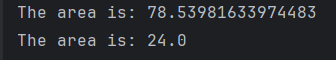
### Mini Challenge Code:
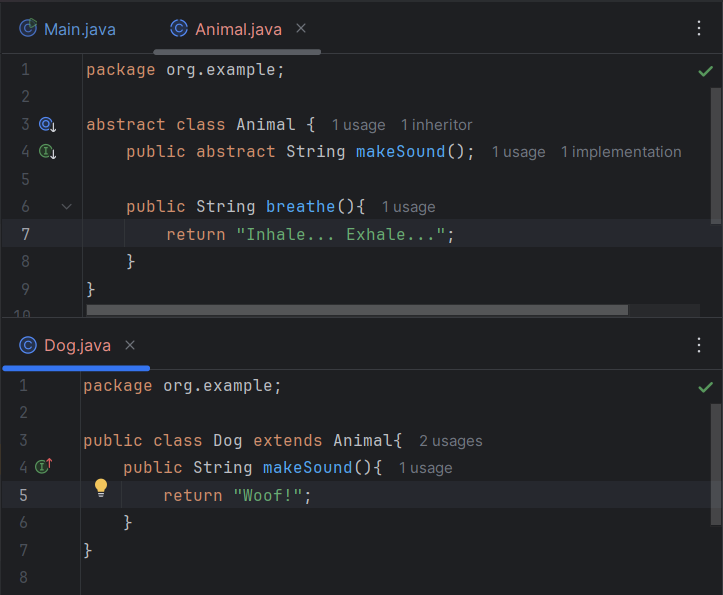

### Mini Challenge Output:
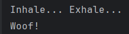

## Exercise 3: Method Overriding: Providing a New Implementation
### Prediction:
<code>
--- Regular Editor --- 
Opening a generic file. 
 
--- Code Editor --- 
Applying syntax highlighting... 
Opening a generic file. 
 
--- Polymorphic Editor --- 
Applying syntax highlighting... 
Opening a generic file. 
</code>

### Observation:
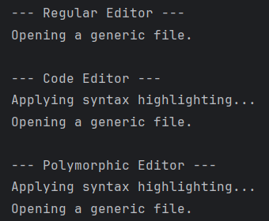
### Mini Challenge Code:
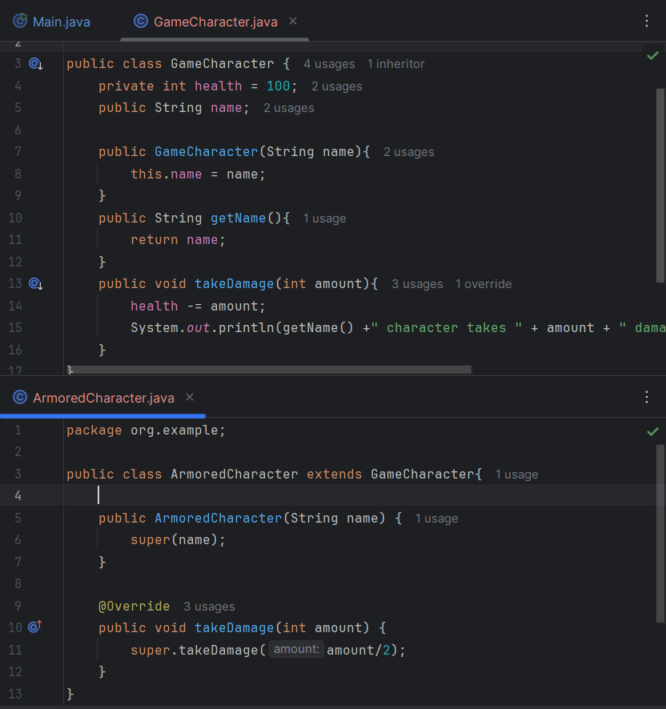
### Mini Challenge Output:
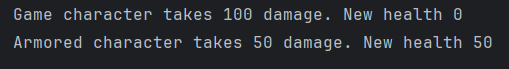

## Exercise 4: Inheriting Variables & Access Rules
### Prediction:
The code will not compile since the balance variable in the parent subclass is set to private which is not inherited by the child class. 
### Observation:
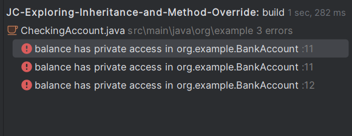
### Mini Challenge Code:
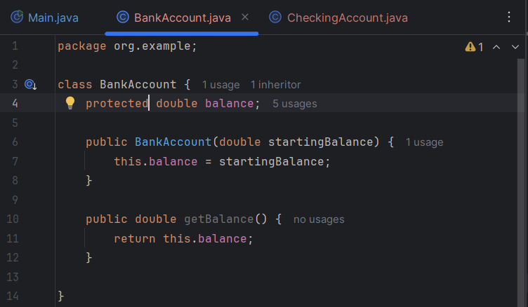

### Mini Challenge Output:

